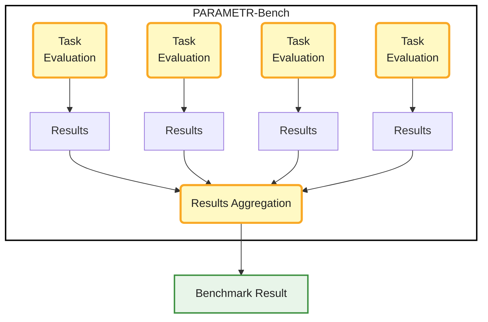

*This article is different from my typical blog posts here, but I wanted to use this platform to write about a personal project in artificial intelligence, I have been working on lately. If you are a reader who came here for the mountains and outdoor adventures, hold tight and future articles will be about that again (or you can keep reading and maybe learn something new).*                  

<div class="intro-note" markdown="1">
**Quick introduction:** I'm a particle physicist with a PhD from the University of Geneva during which I conducted reserch at CERN. There I searched for new elementary particles, contributed to the Athena software framework (the 5M+ line C++/Python codebase used across the ATLAS experiment, one of the largest scientific collaborations in the world) and to the FASER experiment's trigger and data acquisition system.  More recently, I've been working on reinforcement learning from human feedback (RLHF) platforms, designing physics evaluation tasks for frontier large language models.

Problem design is a long thread in my background. As a high school student, I twice represented the Czech Republic at the International Olympiad on Astronomy and Astrophysics (IOAA), winning bronze medals in 2013 and 2014. Since starting university, I've been an organizer of the Czech Astronomy Olympiad, writing competition problems for students.

PARAMETR-Bench, presented in this article, connects these three threads. It started as a curiosity project but grew into something I think is worth sharing. Despite the "Bench" in the name, my aim is not to build yet-another-benchmark, but to show my work and present a few interesting ideas I came across along the way. I welcome any comments and I'm open to discussion - just [reach out](https://otheiner.github.io/#contact).
</div>

## Table of Contents
{:.no_toc}

* TOC
{:toc}

## Motivation

PARAMETR-Bench grew out of my work on RLHF platforms, where I'm paid to create original multimodal physics problems for LLMs. Tasks have to hit specific difficulty thresholds, and crafting a multimodal task only to discover it's too easy is an expensive mistake. I started looking for a way to tune difficulty quickly, and ended up writing most of my tasks as small data generators in Jupyter notebooks: re-run the notebook to get new data, tweak parameters to add noise or scale up the dataset, and the same task becomes harder in seconds.
From there I got curious about the other side — could I send these tasks to LLMs and evaluate the results automatically? I built a few tasks for myself and started building PARAMETR-Bench around them.

*Note: To be clear, the tasks in PARAMETR-Bench are not the ones I've submitted to platforms - those are subject to IP agreements. The tasks here are my work done specifically for this framework, and are built around the same workflow I use on RLHF platforms.*

## Tackling Dataset Contamination and Rubric Drift

Traditional benchmarks rely on fixed test sets that are becoming contaminated or saturated. Common solutions are hiding test sets or constantly adding new questions. These approaches either sacrifice benchmark transparency or require unsustainable effort.

Procedural generation is a third approach that solves leakage by creating fresh instances every run. But it introduces a new problem. Tasks where the answer is a single number can be graded easily but more complex tasks, such as multi-step scientific analyses, that need detailed grading criteria (rubrics) are trickier. Keeping rubrics aligned with dynamically generated data is challenging.

[PARAMETR-Bench](https://github.com/otheiner/PARAMETR-Bench/) addresses this. It combines a procedural task generator, a sandboxed environment for AI agents, and an evaluation harness with LLM-as-judge. Crucially, it uses the same generating process that creates the task data to also instantiate the rubrics. [**Metarubrics**](#metarubrics-and-rubrics) are a novel (and surprisingly simple) methodological concept I haven't seen elsewhere that mitigates contamination and prevents rubric drift by construction. The framework is not restricted to physics - physics is just where my expertise happens to lie - and the PARAMETR-Bench is a proof of concept that might grow in the future into other domains.

## How PARAMETR-Bench Works

PARAMETR-Bench runs multiple evaluation sequences and aggregates their results into a final benchmark score. Each evaluation sequence represents one task at one difficulty level evaluated with one seed. The first diagram shows this high-level structure. The framework executes all sequences and aggregates the results.

<div style="text-align: center; max-width: 400px; margin: 0 auto;" markdown="1">

</div>

When running the benchmark, user specifies two inputs at the start of a run: a set of seeds and a difficulty level. Each seed produces a distinct task instance and the difficulty level is shared across all sequences in the run. The following diagram shows what happens inside a single evaluation sequence.

```mermaid
graph TD
    A1[Seed] --> B(Task Generator)
    A0[Difficulty] --> B
    AP[Agentic Prompt] --> E
    B --> C[Multimodal Input \n Data]
    B --> D[Ground Truth]
    M[Metarubrics] --> RG(Rubrics Creation)
    D --> RG
    RG --> Ru[Rubrics] 
    C --> E(Agentic Loop)
    P[Task Definition] --> E
    F([LLM Agent]) <--> E
    E --> R[Agent's Response]
    Do[/Docker sandbox/] <--> E
    J([LLM Judge]) <--> G
    JP[Judge Prompt] --> G
    Ru --> G(Task Grading)
    R --> G
    G --> S(Statistical Evaluation)
    S --> R3[Results]

    classDef input fill:#f0f0f0,stroke:#9e9e9e,stroke-width:1px,color:#212121
    classDef yellow fill:#fff9c4,stroke:#f9a825,stroke-width:3px,color:#212121
    classDef turquoise fill:#e0f2f1,stroke:#00897b,stroke-width:1px,color:#212121
    classDef red fill:#ffebee,stroke:#c62828,stroke-width:3px,color:#212121
    classDef output fill:#e8f5e9,stroke:#388e3c,stroke-width:2px,color:#212121
    classDef orange fill:#fff3e0,stroke:#e65100,stroke-width:3px,color:#212121

    class M,P,JP,AP input
    class A1,A0 turquoise
    class J,F red
    class B,E,G,RG,S yellow
    class Do orange
```

<div style="text-align: center; max-width: 900px; margin: 0 auto;" markdown="1">

</div>

The sequence begins with the task generator, which takes the seed and difficulty level as inputs and produces two outputs: the multimodal input data (images, tables, text files, or a combination) and the ground truth (the correct answers, stored internally and never shown to the model). In parallel, the ground truth is used alongside the user-defined metarubrics to instantiate the rubrics — the specific grading criteria for this exact task instance.

PARAMETR-Bench supports two evaluation modes. In non-agentic mode, the input data is embedded directly in the prompt sent to the model, which can cause context overflow on larger datasets. In this mode, model has only "one shot" to return the answer, which is extremely difficult. In agentic mode, the model receives only a description of the input files and an environment to explore them — avoiding the context problem entirely.

In agentic mode, the model enters the agentic loop, where it receives the task definition, the multimodal input data, and an agentic prompt. Inside the loop, the model interacts with a Docker sandbox — an isolated, network-blocked execution environment — through a set of available tools:

- **Running python scripts** - executed inside the Docker sandbox, memory-capped at 512 MB, no network access, restricted to a single mounted folder with input data. Only standard Python libraries plus a small task-relevant set of libraries are available.
- **Viewing images** - the framework converts the requested image to base64 and embeds it in the next message.
- **Reading files** - reading text and CSV files from the mounted folder.
- **Writing files** - writing helper files to the mounted folder.
- **Running commands** - a restricted allow-list of exploration commands such as `cd`, `ls`, `grep`, regex-based search and a few other basic shell commands.

The loop continues until the model produces a final response or the maximum number of turns is reached. If the model has not converged by the final turn, it is prompted to report its best result so far.

The LLM judge then receives the model's response alongside the populated rubrics and a judge prompt. It grades the response against each rubric criterion, producing a binary pass or fail for each. These grades feed into statistical evaluation, which aggregates them into a weighted score for this sequence — the sequence's contribution to the final benchmark result.

### Seeded Task Generation with Tunable Difficulty

Task generation in PARAMETR-Bench uses seeded pseudo-random number generators, which is an approach borrowed from Monte-Carlo simulation which I know well through my particle physics background. The same seed always produces the same task instance, while varying the seed produces a virtually infinite stream of fresh ones. This combination of reproducibility and unbounded sampling is the foundation of statistical evaluation in physics, and AI evaluation, viewed as an empirical scientific discipline, benefits from exactly the same property.

Each task also ships with a configuration file that exposes the generator's parameters, grouped into three difficulty levels: easy, medium, and hard. These levels typically differ in dataset size, noise levels, and other parameters that control how challenging the task is to solve.

The [`_count_circles`](https://github.com/otheiner/PARAMETR-Bench/blob/main/tasks/_count_circles/prompt.md) task included in the framework is a useful illustration. Tasks prefixed with an underscore are minimal working examples — not used in evaluation by default, but kept in the repository for demonstration and debugging. The setup is simple: the model receives several images of black circles on a white background and is asked to count the circles in each, then compute the average. With at most 5 circles per image, most modern vision models handle this reliably. With 20 circles per image, even capable models start to miscount. This is precisely where agentic evaluation matters: a model that can write a Python script to detect and count the circles will succeed where direct visual counting fails. The same task, evaluated agentically versus non-agentically, measures qualitatively different capabilities. We will discuss the agentic vs. non-agentic aspect in depth later.

You can try the task generator yourself in the interactive demo hosted on Hugging Face Spaces:

<p style="text-align: center;">
  <a href="https://huggingface.co/spaces/otheiner/PARAMETR-Bench_demo" 
     style="display: inline-block;
            background: linear-gradient(180deg, #ffe066 0%, #ffd21e 40%, #f0b800 100%);
            box-shadow: 0 4px 8px rgba(0,0,0,0.2), inset 0 1px 0 rgba(255,255,255,0.6);
            border: 1px solid #c9960a;
            border-radius: 6px;
            padding: 10px 24px;
            font-family: sans-serif;
            font-size: 14px;
            font-weight: 700;
            color: #1a1a1a;
            text-decoration: none;
            letter-spacing: 0.03em;">
    🤗 Try it yourself!
  </a>
</p>

### Dataset Leak Detection Mechanism

Seeded task generation has an inherent feature: I can generate new tasks of the same difficulty, which makes tasks across different seeds meaningfully comparable. For benchmarking purposes, I propose publishing benchmarking results together with:

- the seeds used in the test
- the difficulty settings
- the evaluated model version
- the model used as judge
- the exact git commit hash, which references the exact state of the repository so the same results can be reproduced in the future

The data themselves are not published — the exact same data are guaranteed by using the same seeds with the same framework version. This setup enables a leak detection mechanism.

If evaluation data from specific public seeds were to leak into a model's training set, the model might show inflated performance due to memorization. This can in principle(\*) be detected by re-running the benchmark with a fresh set of random seeds. A statistically significant performance gap between public seeds and fresh private seeds would provide an indication of a potential data leak — making contamination detectable in principle, unlike static benchmarks where held-out sets differ in content rather than only in seed.

(\*) *This is currently a hypothesis. To test it, I am setting up an experiment described in the section on [long-running contamination experiment](#a-long-running-contamination-experiment)*.


### Metarubrics and Rubrics

The user only needs to define the templates (metarubrics), and the framework handles the rest. In this context, metarubrics are analogous to classes in object-oriented programming, while rubrics are specific instances of those classes instantiated with unique parameters for a given task. 

The user provides a high-level template with placeholders.

```json
"metarubrics": [
    {
      "key": "z_estimation",
      "source": "analyzed_galaxies",
      "name": "Redshift estimation",
      "description": "Did the model compute that galaxy {galaxy_ID} has redshift {z}, or a value strictly inside the interval [{z_min}, {z_max}]?",
      "weight": 5.0
    }
]
```

The framework populates the template using the ground truth stored in pandas DataFrames from the procedurally generated dataset.

```json
"metarubrics": [
    {
      "key": "z_estimation",
      "name": "Redshift estimation",
      "weight": 5.0,
      "total": 3,
      "rubrics": [
        {
          "id": 1,
          "criterion": "Did the model compute that galaxy GID075008 has redshift 0.02978, or value strictly inside interval [0.02928 , 0.03028]?"
        },
        {
          "id": 2,
          "criterion": "Did the model compute that galaxy GID104365 has redshift 0.01951, or value strictly inside interval [0.01901 , 0.02001]?"
        },
        {
          "id": 3,
          "criterion": "Did the model compute that galaxy GID173179 has redshift 0.01831, or value strictly inside interval [0.01781 , 0.01881]?"
        }
      ]
    }
]
```

### Evaluation Harness for AI Agents

(TODO: This section is still being worked on)

## Tasks Included in PARAMETR-Bench

Currently, there are four proper tasks and two minimal working example tasks in the repository. Initial tasks I created for PARAMETR-Bench have a few common features:

1. They are motivated by real science. Some of the tasks are inspired by the Nobel-prize level discoveries that revolutionized fields such as cosmology, or particle physics.
2. Multi-step nature - tasks consist of multiple steps combining scientific reasoning, data exploration, python code implementation.
3. Data used as an input are multimodal (images, tables, text files)
4. Adversarial by nature and designed to challenge models in things I noticed to be difficult.

### A Worked Example: Cepheid Period-Luminosity Calibration

(TODO: This section is still being worked on)

### Other Tasks in the Framework

Apart from the `cepheid_calibration` task, there are three more complex physics tasks and two minimal working examples to demonstarte the framework on the simplest cases. These minimal working examples are by default not included when running the whole benchmark, unless user specifies them. Following paragraphs briefly describe tasks currently included in the framework. For more details, check [Hugging Face Space](https://huggingface.co/spaces/otheiner/PARAMETR-Bench_demo) or `tasks` folder in [GitHub repo](https://github.com/otheiner/PARAMETR-Bench/).

 - [`hubble_constant`](https://github.com/otheiner/PARAMETR-Bench/blob/main/tasks/hubble_constant/prompt.md): A data-analysis task inspired by Edwin Hubble's original work, one of the foundational results of observational cosmology. The model analyzes spectroscopic data to identify redshifts of fictitious galaxies, then combines this with Cepheid photometric data for distance calibration, and uses the result to estimate the local rate of cosmic expansion - the Hubble constant. It's effectively the inverse of the Cepheid calibration task, with a different spectral representation. The Hubble constant value is drawn fresh each run from a distribution whose mean is offset from current measurements, preventing the model from guessing a memorized value and forcing it to actually perform the analysis.

 - [`invariant_mass_reconstruction`](https://github.com/otheiner/PARAMETR-Bench/blob/main/tasks/invariant_mass_reconstruction/prompt.md): A simplified version of an analysis performed by particle physicists at accelerators like the Large Hadron Collider at CERN. The model receives a description of the detector geometry and the simulated detector data - simplified readouts from a silicon tracker and an electromagnetic calorimeter. The data contain events in which an unknown particle decays into an electron-positron pair. For each event, the model must reconstruct the tracks of both particles (fitting a helix to the tracker hits) and combine them to compute the invariant mass of the parent particle. It then plots a histogram of these reconstructed masses across all events, identifies a peak on top of an exponentially decaying background, and extracts the mass and decay width of the unknown particle. Both quantities are drawn fresh from a probability distribution each run, so the model cannot succeed by guessing a memorized particle - it has to perform the full analysis to recover the values. The full real-world version of this analysis is extremely difficult; the task makes a few targeted simplifications that remove sub-problems unrelated to the core analytical chain (particle identification, vertex reconstruction, hit-level noise, shape of the background, ...) while preserving the analytical reasoning the task is designed to test.

 - [`lissajous_figures`](https://github.com/otheiner/PARAMETR-Bench/blob/main/tasks/lissajous_figures/prompt.md): The model is placed in the role of a physicist performing quality assurance at a company manufacturing AC power supplies. The key analytical step is reading Lissajous figures (see the image bellow) - spatially complex plots produced by combining two oscillating signals - to determine the frequency of the power supply under test. The estimation requires counting the ratio of lobes touching the vertical and horizontal axes of the figure. This is a simple task for human visual inspection but deceptively difficult even for capable vision models, and remains non-trivial even with agentic tool use.

 

Two minimal working examples follow. These tasks are simple and require no physics knowledge, so a potential contributor from a different field can examine the framework without having to understand the physics tasks. Both tasks have names prefixed with an underscore - by convention, tasks in PARAMETR-Bench whose names start with `_` are minimal working examples and are not included in the default benchmark evaluation, but they remain in the repository for demonstration and debugging. Even though both tasks are deliberately simple, they reveal interesting LLM failure modes. They're useful both as framework demonstrations and as small empirical probes of what current models still struggle with.

  - [`_count_circles`](https://github.com/otheiner/PARAMETR-Bench/blob/main/tasks/_count_circles/prompt.md): The model receives several images of black circles on a white background and is asked to count the circles in each, then compute the average. With few circles per image, most vision models handle this easily; with many circles per image, even capable models start to miscount, making this a useful illustration of when agentic evaluation outperforms direct visual reasoning.
  - [`_compute_average`](https://github.com/otheiner/PARAMETR-Bench/blob/main/tasks/_compute_average/prompt.md): The model is given a list of numbers and asked to compute their average. Trivially easy in principle, but less capable models sometimes hallucinate the result when the list is long or the numbers contain many decimal places.


## Results

### Initial Evaluation

(TODO: public vs. private seeds results)

### A Long-Running Contamination Experiment

The seeded-generation design provides a theoretical contamination resistance - but a theoretical property is not an empirical one. To actually test whether contamination is detectable in practice, the published evaluation set needs to leak into model training data, and then I need a way to measure that it leaked.

I cannot force a leak to happen, but I can make it as likely as possible. The strategy is to publish the public seed set together with results now, and to wait several months until the next generation of models is trained on web data crawled in the meantime. Unlike most benchmarks - which try to mitigate the risk of dataset leakage - I am deliberately maximizing the probability of leakage for a specific, pre-registered subset of seeds.

The measurement comes from the comparison between two seed sets evaluated on the same future model:

- A **public seed set**, published now along with the corresponding generated input data on [Hugging Face](https://huggingface.co/datasets/otheiner/PARAMETR-Bench).
- A **private seed set**, drawn from the same generator distribution at the same difficulty levels but withheld from publication.

At publication time, both sets are equivalent: same generator, same parameters, same statistical properties. If a model trained months from now has been exposed to the public seed set, its performance on those seeds should be measurably higher than its performance on the held-out private seeds. A statistically significant gap would constitute evidence of contamination; a null result would constitute evidence that the framework's contamination resistance survives even direct exposure.

To maximize the chances of leakage being detectable, I am publishing not only the seeds themselves but also the generated input data — images, tables, and ground-truth artifacts produced from those seeds. Web crawlers are far more likely to ingest static data files than to execute a generator script, so this raises the prior probability of contamination occurring at all.

This is a slow experiment by design. The first contamination signal cannot arrive until at least one new model generation has been trained, so the most informative results from this experiment will appear in follow-up posts over the coming months and years.

## Related work

(TODO: This section is still being worked on)

## Limitations and What's Next

(TODO: This section is still being worked on)

## Conclusion

(TODO: This section is still being worked on)
